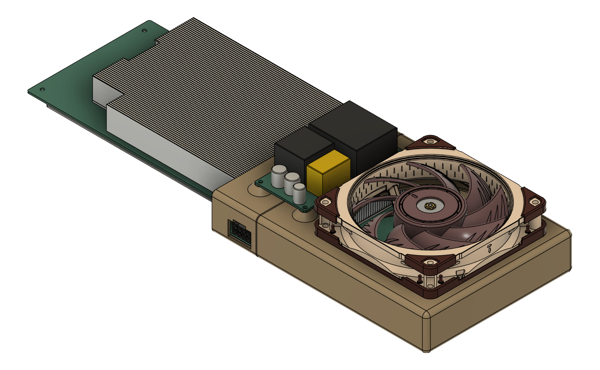
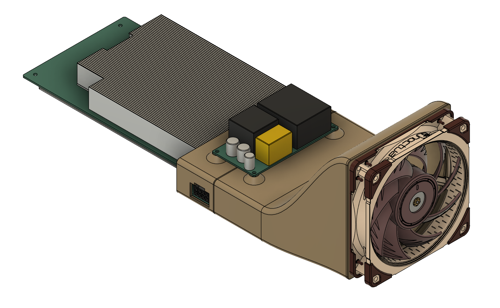

# BC-250 3D-Printed Fan Sleeve/Adapter

A 3D-printed sleeve/adapter designed for the ASRock AMD BC-250 blade to connect it with a standard 120 mm fan, allowing it to be used outside of a rack for desktop, gaming, or other applications.

The models are available in two versions, and designed to use with or without the [Mean Well LOP-300-12 PSU](https://www.meanwell-web.com/en-gb/ac-dc-low-profile-open-frame-power-supply-150-peak-lop--300--12).

### Version A

A more compact design that requires less filament to print.

### Version B

A visually appealing design that prints without supports.

## File Structure

- `files/version-a/` – Contains files for Version A

  - `bc-250-fan-sleeve-adapter-a1.step` – Left part of the sleeve
  - `bc-250-fan-sleeve-adapter-a2.step` – Right part of the sleeve

- `files/version-b/` – Contains files for Version B

  - `bc-250-fan-sleeve-adapter-b1.step` – Left part of the sleeve
  - `bc-250-fan-sleeve-adapter-b2.step` – Right part of the sleeve

- `files/bc-250-body.step` – A general mockup of the BC-250 blade for reference.

## Printing Recommendations

- **Material**: PETG is recommended for its heat resistance, but in practical use, standard PLA also performs well;
- **Sparse Infill**: is 100%, good for heated inserts;
- **Layer Height**: 0.2mm or higher; feel free to use larger nozzles to speed up your prints;
- **Supports**: Most of the parts are don't needed supports, `bc-250-fan-sleeve-adapter-a2.step` is need for fan opening;
- **Bed Adhesion**: Using a brims is highly recommended.

## Installation

1. Each part slides onto the BC-250 blade from opposite sides.
2. The two halves are secured together using the power supply unit or dummy plate.
3. **Optional:** Adding M3x5 mm heated inserts improves stability.

## Fan Choice

Any 120 mm fan will work, but models with **higher static pressure** are recommended for better cooling performance.

## Temperatures

Below **68-70°C @ 150W PPT** with the fan spinning at **2200 RPM.**

## License

This project is licensed under the [Attribution-NonCommercial-ShareAlike 4.0 International (CC BY-NC-SA 4.0)](https://creativecommons.org/licenses/by-nc-sa/4.0/), allowing personal use, modifications, and redistribution with attribution.

## Contributions

If you have improvements or modifications, feel free to submit a pull request!
